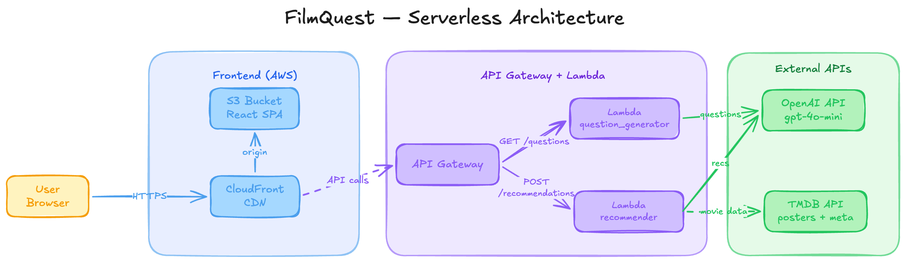

# FilmQuest



A mood-based movie recommendation app. Answer a series of cinema-themed questions about your current mood and preferences, and get personalized film recommendations powered by AI.

## Tech Stack

- **Frontend**: React 19, TypeScript, Vite -- hosted on S3 + CloudFront
- **Backend**: Python 3.13 AWS Lambda functions behind API Gateway
- **AI**: OpenAI API (gpt-4o-mini) for question generation and recommendations
- **Movie Data**: TMDB API for posters, ratings, and metadata
- **Infrastructure**: Terraform, deployed to AWS (eu-south-2)

## Architecture

```
CloudFront --> S3 (React SPA)

API Gateway
  GET  /questions       --> Lambda (question_generator)
  POST /recommendations --> Lambda (recommender)
```

Secrets (OpenAI and TMDB API keys) are stored in AWS Systems Manager Parameter Store.

## Project Structure

```
backend/
  question_generator/   # Generates mood/preference questions via OpenAI
  recommender/          # Takes answers, gets recommendations via OpenAI + TMDB
  server.py             # FastAPI wrapper for local development
frontend/               # React + Vite SPA
infra/                  # Terraform configuration
scripts/
  deploy.py             # Deploys frontend and/or Lambda functions
```

## Local Development

Prerequisites: Node.js, Python 3.12+, [uv](https://docs.astral.sh/uv/)

```bash
# Install Python dependencies
uv sync

# Start the backend dev server
cp .env.example .env  # add your API keys
uv run python backend/server.py

# Start the frontend dev server
cd frontend
npm install
npm run dev
```

## Deployment

Infrastructure is managed with Terraform:

```bash
cd infra
terraform init
terraform apply
```

Deploy application code:

```bash
python scripts/deploy.py all               # everything
python scripts/deploy.py frontend          # frontend only
python scripts/deploy.py lambdas           # both lambdas
python scripts/deploy.py lambda:questions   # single lambda
python scripts/deploy.py lambda:recommender
```

## Configuration

Terraform variables (`infra/variables.tf`):

| Variable               | Default       |
|------------------------|---------------|
| `aws_region`           | `eu-south-2`  |
| `project_name`         | `filmquest`   |
| `openai_model`         | `gpt-4o-mini` |
| `recommendation_count` | `5`           |
